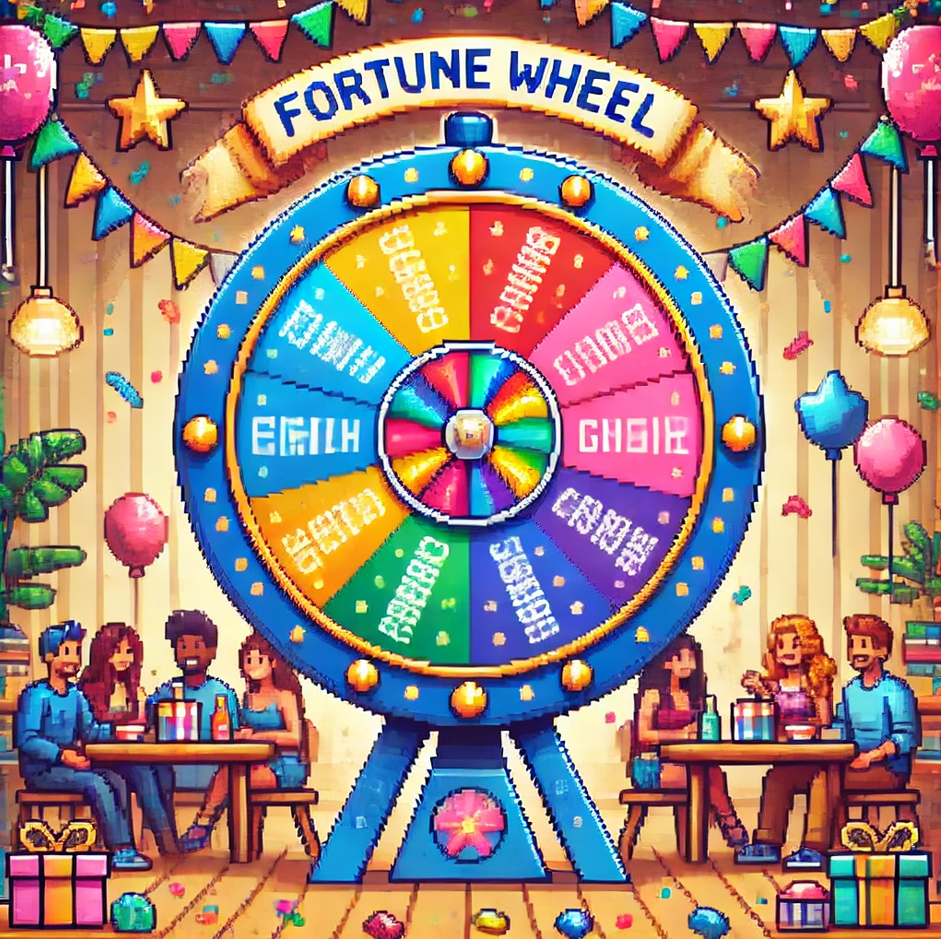

    

<h1 align="center"> ¡Sorteador de amigos! </h1>

   

   
   

  
Este proyecto es un sorteador aleatorio de amigos que permite agregar nombres a una lista, validar su formato, y seleccionar un amigo al azar. El objetivo principal es proporcionar una experiencia simple y fácil de
   usar para realizar sorteos de una manera simple y confiable.

   
## Características: 
  Agregar amigos: Permite agregar nombres de amigos a la lista.
  Validación de entradas: Valida que los nombres ingresados sean correctos (solo letras, sin números o caracteres especiales).
  Sorteo aleatorio: Selecciona un nombre aleatorio de la lista de amigos.
  Visualización: Muestra la lista de amigos y el amigo sorteado en la interfaz.

## Requisitos: 
  Este proyecto no tiene dependencias externas y solo utiliza JavaScript, HTML y CSS básicos. No requiere de ninguna instalación adicional.

## Cómo usarlo:

- `Agregar un amigo:`
Escribe un nombre en el campo de texto y haz clic en el botón "Agregar Amigo".
El nombre se agregará a la lista de amigos si cumple con las validaciones (solo letras, no números).

- `Sorteo:` Haz clic en el botón "Sortear Amigo" para seleccionar un nombre aleatorio de la lista de amigos.
Si no hay amigos en la lista, aparecerá un mensaje indicando que no hay amigos para sortear.

- `Validaciones:` Si intentas agregar un nombre vacío, un número o un nombre con caracteres no permitidos, se mostrará una alerta solicitando una entrada válida.

## Estructura del Proyecto:
index.html
Contiene el HTML básico donde se encuentra el campo de texto para ingresar los nombres, los botones de acción, y las listas que muestran los amigos y el resultado del sorteo.

styles.css
Contiene los estilos opcionales para mejorar la apariencia del proyecto.

script.js
Contiene la lógica de JavaScript que permite agregar nombres, validarlos, generar sorteos aleatorios y actualizar la interfaz.

## Contribuciones
¡Las contribuciones son bienvenidas! Si deseas mejorar este proyecto, puedes hacer un fork del repositorio, realizar tus cambios y crear un Pull Request.

## Video grafico y explicativo
<video width="320" height="240" controls>
  <source src="Explicacion.mp4" type="video/mp4">
  Tu navegador no soporta la etiqueta de video.
</video>
